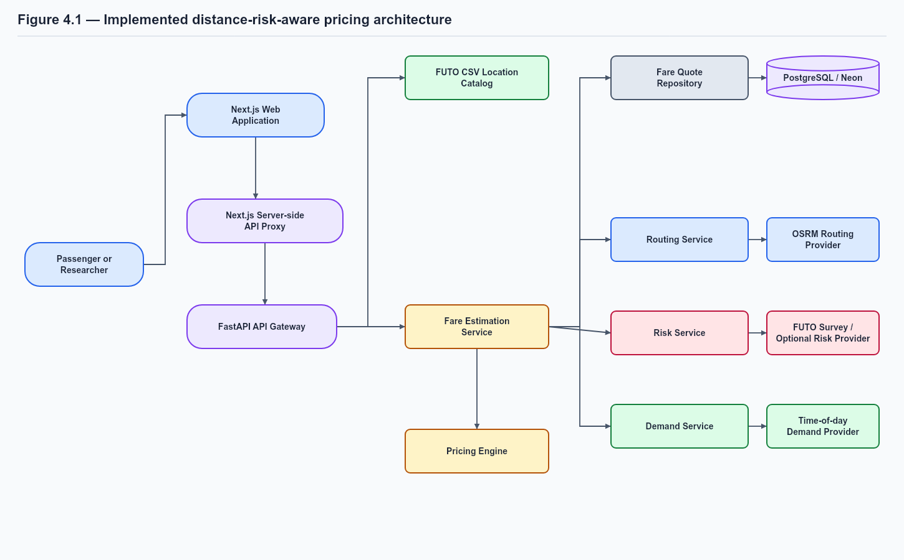
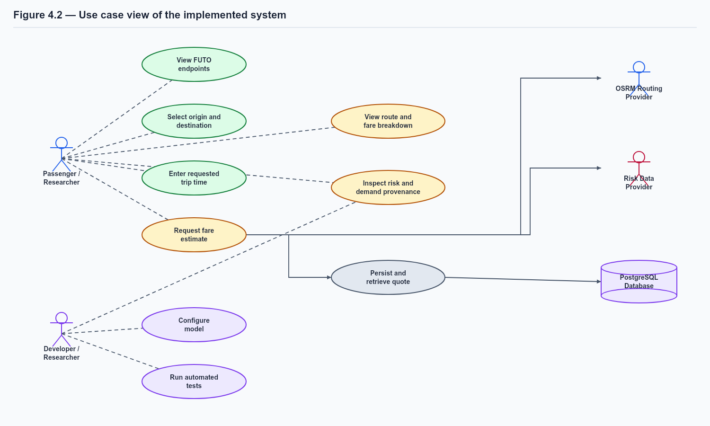
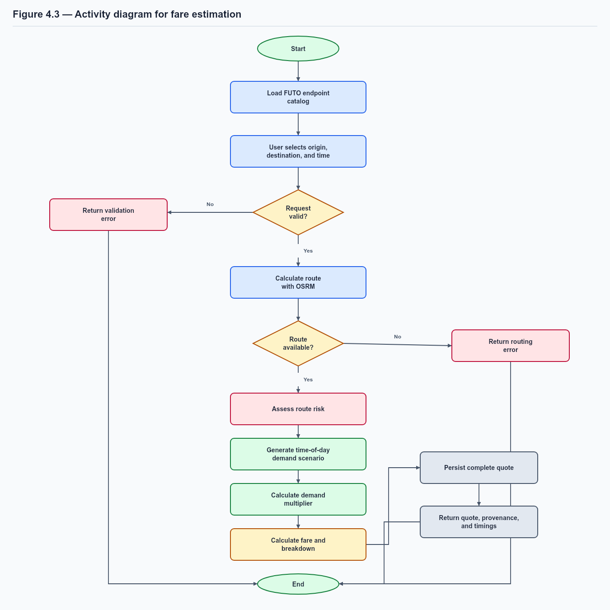
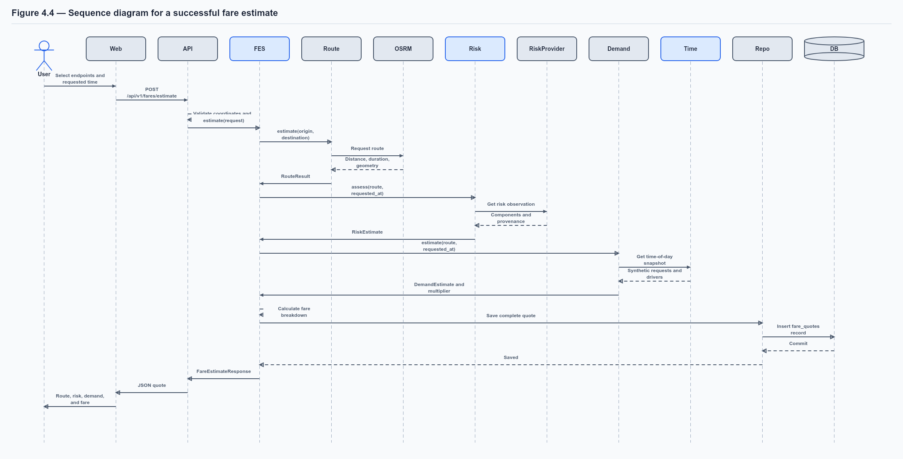
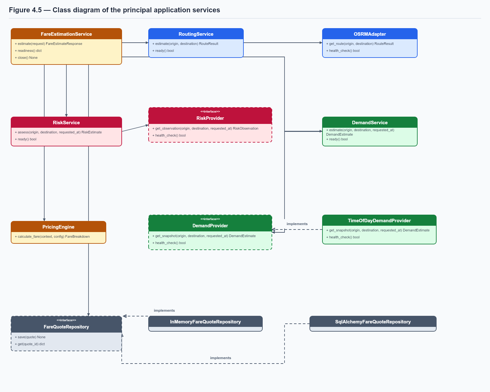
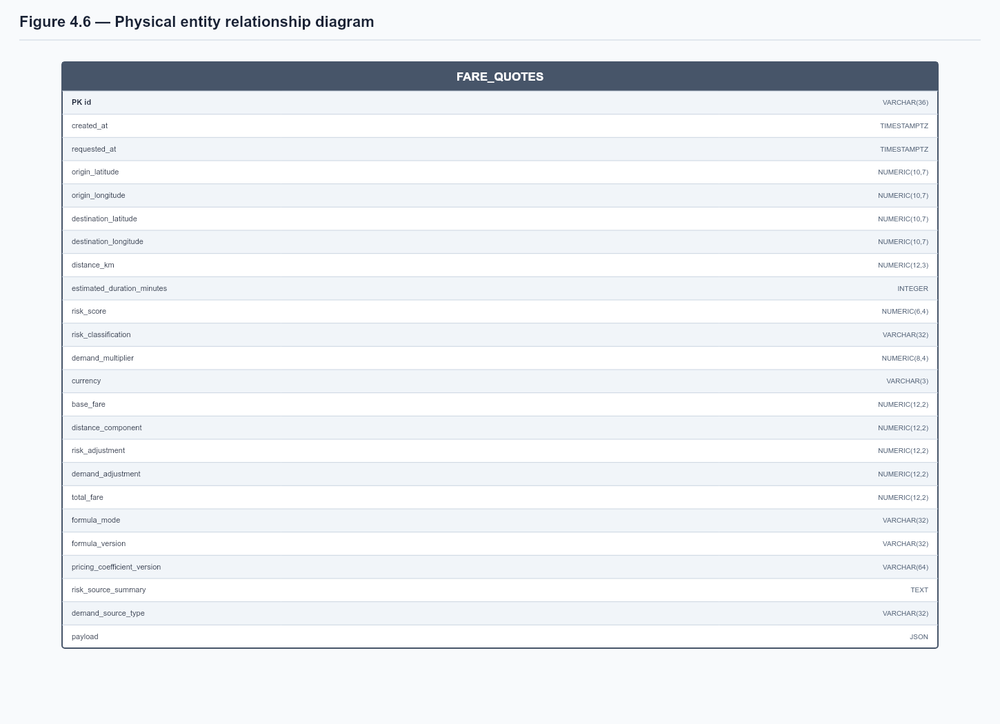

# CHAPTER FOUR

## SYSTEM DESIGN, IMPLEMENTATION AND TESTING

### 4.1 System Overview

This chapter presents the design and implementation of the Distance-Risk-Aware
Dynamic Pricing Model for City Transportation Services. The system accepts a
selected origin, destination, and requested trip time; obtains the authoritative
route distance and estimated duration; evaluates route risk; calculates a
time-dependent demand condition; and combines the resulting values into a
transparent fare estimate. The user is shown both the final fare and the
individual components that produced it.

The implemented prototype is a web application. The presentation layer is a
Next.js application located in apps/web. The browser communicates with one
public FastAPI gateway rather than calling the internal pricing, routing, risk,
or demand modules separately. The backend preserves those modules as logical
service boundaries inside one Python process. This arrangement is appropriate
for the academic prototype because it provides modularity and testability
without introducing the operational complexity of independently deployed
microservices.

The current demonstration is focused on Federal University of Technology,
Owerri (FUTO) endpoints. The origin and destination options are loaded from
the supplied FUTO Route Endpoint Coordinate Collection.csv file. The system
does not use hard-coded mock locations in the user interface. Each catalog
record retains its collection timestamp, source, source URL, and notes so that
the endpoint selection remains traceable.

The prototype uses OSRM for route calculation and the supplied FUTO survey
profile for questionnaire-derived route risk. Open-Meteo remains available as
an optional weather-derived road-risk signal. Because verified ride-request
and driver-availability data are not available for this academic study, demand
is generated by an explicitly labelled time-of-day simulation in the
Africa/Lagos timezone. The demand simulation makes no traffic-provider request
and must not be interpreted as observed traffic or as a calibrated commercial
pricing policy.

The principal processing sequence is:

1. The user selects two FUTO endpoints and a requested trip time.
2. The frontend sends their coordinates and a timezone-aware timestamp to the
   FastAPI gateway.
3. The Routing Service obtains route distance, duration, and geometry.
4. The Risk Service obtains a questionnaire-derived route/time score or another
   configured risk signal and produces a normalised Route Risk Coefficient.
5. The Demand Service applies the configured time-of-day scenario.
6. The Pricing Engine combines distance, risk, and demand.
7. The repository stores the complete quote and the API returns the fare
   breakdown, provenance labels, and processing timings.

This design directly implements the conceptual model described in Chapters
One and Two while preserving the limitations identified in Chapter Three.

### 4.2 System Architecture

The system uses a layered client-server architecture. The frontend provides
the interaction layer, the API gateway provides validation and orchestration,
the domain services provide business rules, and repositories or external
adapters provide persistence and external data access.

**Figure 4.1: Architecture of the implemented distance-risk-aware pricing
system**

The browser is restricted to the public API gateway. This prevents the
frontend from becoming dependent on internal module names and prevents
database credentials or provider credentials from being exposed to the client.
The gateway creates the application services through dependency injection and
converts internal domain objects into stable Pydantic response schemas.

The logical services are not separate network processes in the current
implementation. FareEstimationService coordinates them in sequence. The
Routing Service owns route-provider interaction and route caching. The Risk
Service owns risk-provider interaction, component validation, weight handling,
and classification. The Demand Service owns demand-provider validation and
the demand multiplier. The Pricing Engine contains the fare formula and
returns a decomposable FareBreakdown object. This separation allows individual
components to be tested independently and permits later extraction into
separate services if the research project grows.

#### 4.2.1 Use Case Diagram

The principal actors are the passenger or researcher using the fare estimator,
the project developer or researcher maintaining the model, the routing
provider, the optional risk provider, and the database. The passenger and
researcher share the same estimation workflow, while the developer is
responsible for configuration, testing, and model-version management.

**Figure 4.2: Use case view of the implemented system**

The use case design deliberately excludes accounts, payments, driver
registration, dispatch, and live driver tracking. These functions are outside
the scope defined in Chapter One. The implemented research contribution is the
auditable fare-estimation workflow.

#### 4.2.2 Activity Diagram

The activity diagram shows the processing of a fare request. Validation occurs
before external calls or pricing. If an endpoint catalog, route, risk source,
or repository is unavailable, the system returns an explicit error rather than
silently replacing a missing value with an unlabelled result.

**Figure 4.3: Activity diagram for fare estimation**

The activity is deterministic for a fixed set of coordinates, configuration,
provider responses, and requested timestamp. The route may vary when the
external routing provider changes its network data, while the questionnaire
score varies by the selected route and survey time band. These dependencies
are recorded in the response provenance.

#### 4.2.3 Sequence Diagram

The sequence diagram describes the interactions for one successful fare
request. Risk Provider represents the configured risk mode. In local
development it can be the FUTO questionnaire provider, the deterministic
simulated provider, or Open-Meteo when explicitly configured. Demand always
follows the local time-of-day simulation for this prototype.

**Figure 4.4: Sequence diagram for a successful fare estimate**

#### 4.2.4 Class Diagram

The class design separates orchestration from domain rules and external
adapters. Provider protocols define the behaviour required by the domain
services, which makes deterministic test doubles possible.

**Figure 4.5: Class diagram of the principal application services**

### 4.3 Tools and Technologies Used

Table 4.1 describes the technologies used by the implemented prototype and
explains the reason for each selection. The choices prioritise readable
interfaces, strong validation, reproducibility, and a deployment path suitable
for a student research project.

**Table 4.1: Technologies used and reasons for selection**

| Technology or tool | Layer or responsibility | Reason for selection |
|---|---|---|
| Python 3.11+ | Backend language | Provides type hints, asynchronous I/O, standard timezone support, and a mature testing ecosystem. |
| FastAPI | API gateway | Provides typed REST endpoints, request validation, automatic OpenAPI documentation, and asynchronous request handling. |
| Pydantic | API and configuration schemas | Validates coordinates, timestamps, settings, and provider responses before business rules execute. |
| SQLAlchemy | Persistence layer | Separates Python domain objects from database storage and supports PostgreSQL without placing SQL inside route handlers. |
| Alembic | Database migrations | Versions schema changes so the database can be reproduced and updated safely. |
| PostgreSQL / Neon | Production database | Provides durable relational storage suitable for auditable fare quotes and exact numeric values. |
| Next.js and React | Web frontend | Provides a responsive web application with client interaction, server-side proxy support, and a maintainable route structure. |
| TypeScript | Frontend language | Detects incorrect API and component usage before deployment and documents the frontend data contract. |
| Tailwind CSS | Frontend styling | Allows consistent responsive layouts and rapid implementation of the documented interface design. |
| OSRM and OpenStreetMap data | Routing | Supplies road-network route distance, estimated duration, and GeoJSON geometry rather than relying on straight-line distance. |
| FUTO road-risk questionnaire profile | Risk input | Supplies an aggregate route/time perceived-risk score while preserving response counts and provenance. |
| Open-Meteo | Optional risk input | Provides a no-key weather endpoint from which a clearly labelled road-condition signal can be derived. |
| CSV and Python zoneinfo | Location and time inputs | Keeps the supplied FUTO catalog portable and makes local-time demand windows explicit and reproducible. |
| Pytest and pytest-asyncio | Backend testing | Supports unit, asynchronous adapter, service-boundary, and API tests. |
| Ruff | Python quality checks | Detects formatting and common static-analysis problems in changed Python modules. |
| uv | Dependency and environment management | Reproduces pinned Python dependencies through pyproject.toml and uv.lock. |
| Render, Vercel, and Neon | Deployment | Separates the backend, web frontend, and managed database in line with the project deployment plan. |

The choices were made because they match the scope of the project. For
example, FastAPI and Pydantic are sufficient for the public API and provide
strong validation without requiring a large framework. PostgreSQL is used for
durable quote storage, but an in-memory repository remains available for local
tests. OSRM is used only for route calculation; it is not presented as a
traffic-demand source. Similarly, the time-of-day demand provider avoids an
unavailable commercial data dependency while preserving a repeatable
experimental input.

### 4.4 Database Design

#### 4.4.1 Database Design Approach

The database is designed around an auditable fare quote. Every successful fare
estimate is stored as one immutable quote record containing the request time,
coordinates, route output, risk output, demand output, pricing components,
provenance, version information, and a complete JSON payload.

Only the fare_quotes table is physically implemented in the current prototype.
Separate user, driver, vehicle, payment, trip-dispatch, or live-demand tables
were not created because those functions are explicitly outside the project
scope. The system is a fare-estimation research prototype, not a complete
ride-hailing transaction platform.

The table is intentionally denormalised at the audit boundary. The route,
risk, demand, and fare objects are returned together in one quote response, so
storing their principal values as columns makes common retrieval and analysis
simple. The original response is also stored in payload so that additional
provenance and timing fields are not lost. This design is suitable for the
current scale and can later be normalised into route, risk, demand, and pricing
tables if the application begins to manage many operational entities.

#### 4.4.2 Entity Relationship Diagram

The physical ERD contains one table because the implemented persistence
requirement is the storage and retrieval of complete fare quotes. There are no
foreign-key relationships in the current schema. This is a deliberate result
of the project scope, not an omitted relationship between entities that the
prototype claims to implement.

**Figure 4.6: Physical entity relationship diagram for the implemented
database**

The logical relationship inside a quote is an aggregation: one fare quote
contains one route result, one risk estimate, one demand estimate, and one fare
breakdown. These are application objects in the current implementation rather
than separate relational tables. The JSON payload preserves this logical
structure.

#### 4.4.3 Fare Quotes Table Specification

Table 4.2 documents every column in the implemented table. PostgreSQL
timestamp columns use timezone-aware values. Numeric columns were migrated
from floating-point columns to NUMERIC columns so that fare values and risk
values do not acquire avoidable binary rounding errors.

**Table 4.2: fare_quotes fields, constraints, and purposes**

| Field | PostgreSQL type | Constraints | Purpose |
|---|---|---|---|
| id | VARCHAR(36) | Primary key, not null | Stores the UUID-style quote identifier returned to the client. |
| created_at | TIMESTAMPTZ | Not null | Records when the server generated the quote. |
| requested_at | TIMESTAMPTZ | Not null | Records the requested journey time used by risk and demand logic. |
| origin_latitude | NUMERIC(10,7) | Not null; application range -90 to 90 | Stores the selected origin latitude. |
| origin_longitude | NUMERIC(10,7) | Not null; application range -180 to 180 | Stores the selected origin longitude. |
| destination_latitude | NUMERIC(10,7) | Not null; application range -90 to 90 | Stores the selected destination latitude. |
| destination_longitude | NUMERIC(10,7) | Not null; application range -180 to 180 | Stores the selected destination longitude. |
| distance_km | NUMERIC(12,3) | Not null; positive route result | Stores authoritative routed distance in kilometres. |
| estimated_duration_minutes | INTEGER | Not null | Stores the route provider's rounded travel-duration estimate. |
| risk_score | NUMERIC(6,4) | Not null; application range 0 to 1 | Stores the aggregated Route Risk Coefficient. |
| risk_classification | VARCHAR(32) | Not null | Stores Low, Moderate, High, or Very High. |
| demand_multiplier | NUMERIC(8,4) | Not null; application minimum 1 | Stores the demand value supplied to the pricing engine. |
| currency | VARCHAR(3) | Not null; three uppercase letters | Stores the fare currency, currently NGN. |
| base_fare | NUMERIC(12,2) | Not null | Stores the distance-adjusted base fare, subject to the configured minimum. |
| distance_component | NUMERIC(12,2) | Not null | Retained for response compatibility and stored as zero because distance is included in base_fare. |
| risk_adjustment | NUMERIC(12,2) | Not null | Stores the risk contribution to the fare. |
| demand_adjustment | NUMERIC(12,2) | Not null | Stores the demand contribution to the fare. |
| total_fare | NUMERIC(12,2) | Not null | Stores the rounded final fare returned to the client. |
| formula_mode | VARCHAR(32) | Not null | Identifies additive or multiplicative calculation strategy. |
| formula_version | VARCHAR(32) | Not null | Identifies the version of the selected pricing formula. |
| pricing_coefficient_version | VARCHAR(64) | Not null | Identifies the coefficient set used for the estimate. |
| risk_source_summary | TEXT | Not null | Stores a readable summary of risk data-source labels. |
| demand_source_type | VARCHAR(32) | Not null | Identifies simulated, observed, or external demand provenance. |
| payload | JSON | Not null | Stores the complete API response for quote retrieval and audit inspection. |

The not-null constraints ensure that a persisted quote is complete. The
database stores the basic structural constraints, while Pydantic and domain
services enforce semantic constraints such as coordinate bounds, risk range,
positive route distance, timezone-aware requested_at, risk-weight sum, and
demand-cap validity. This division prevents invalid requests from reaching the
database and keeps domain rules visible in the application layer.

#### 4.4.4 Repository and Migration Design

The FareQuoteRepository protocol defines save and get operations without
coupling the application service to a concrete database library. The
InMemoryFareQuoteRepository is used in development and tests. The
SqlAlchemyFareQuoteRepository maps the response objects into fare_quotes and
uses a background thread for synchronous SQLAlchemy work so that the
asynchronous API event loop is not blocked by database operations.

The first migration created the table. The second migration replaced
floating-point numeric columns with PostgreSQL NUMERIC columns. The second
migration is important because money, risk coefficients, and model outputs
should be stored consistently for later research analysis.

### 4.5 Implementation of the Pricing Model

#### 4.5.1 Location Catalog and Route Input

The supplied FUTO CSV is read through LocationCatalog.from_csv. The loader
validates the required columns, parses latitude and longitude, rejects
non-finite coordinates, checks the source URL scheme, and preserves timestamp,
source, URL, and notes. A row-based location identifier prevents duplicate
endpoint names from silently overwriting one another.

The API exposes the catalog through GET /api/v1/locations. The frontend calls
this endpoint when the estimator loads and creates dropdown options from the
response. FUTO Main Gate and FUTO Back Gate are selected as convenient initial
defaults when they are present. The route preview uses the selected endpoint
coordinates, but the backend remains authoritative for route distance.

The Routing Service sends the selected coordinates to OSRM using the driving
profile. OSRM returns distance in metres, which is converted to kilometres,
estimated duration in seconds, which is rounded to minutes, and GeoJSON route
geometry. The adapter validates the returned structure, retries transient
failures, and applies bounded in-process caching for repeated route requests.

#### 4.5.2 Route Risk Calculation

The system retains a weighted component model for providers that supply
independent accident, road, and security signals:

~~~text
R = w_acc R_acc + w_road R_road + w_sec R_sec
~~~

where each component is expected to be in the interval [0, 1] and the
configured weights sum to one. The default prototype weights are:

| Component | Symbol | Default weight |
|---|---|---:|
| Accident risk | R_acc | 0.40 |
| Road-condition risk | R_road | 0.30 |
| Security risk | R_sec | 0.30 |

The default provider now uses the supplied FUTO Road Risk Assessment Survey.
The questionnaire records one composite perceived-risk label for each route
and time band; it does not measure accident, road, and security components
independently. The implementation therefore maps the ordinal response to the
midpoint of its classification band and averages respondents:

~~~text
R_questionnaire = (1 / n) x SUM((risk_ordinal - 0.5) / 4)
~~~

The resulting anchors are Low Risk = 0.125, Moderate Risk = 0.375, High Risk
= 0.625, and Very High Risk = 0.875. Exact route/time profiles are used when
the route can be matched to the supplied endpoint coordinates. If the selected
endpoint pair is not one of the surveyed routes, the provider uses the
corresponding all-survey-routes time prior. Both the route match and fallback
are recorded in `data_sources`.

The composite value is returned in `components.questionnaire`. The
`accident`, `road`, and `security` response fields remain null because filling
them with the same questionnaire value would falsely imply three independent
measurements. The response identifies `questionnaire` as the available signal
and uses `questionnaire_composite_score` as the weight strategy.

Risk scores are classified using the following intervals:

**Table 4.3: Route-risk classification**

| Classification | Score interval | System behavior |
|---|---|---|
| Low | 0.00 to 0.25 | No risk premium is applied; the demand adjustment remains independent. |
| Moderate | Greater than 0.25 to 0.50 | The continuous beta x D x R_p risk premium is applied. |
| High | Greater than 0.50 to 0.75 | A higher continuous beta x D x R_p risk premium is applied. |
| Very High | Greater than 0.75 to 1.00 | The maximum normalized risk premium is applied. |

The selected `futo_survey` provider returns `source_type=questionnaire`, the
survey profile model version, response counts, time-band selection, and route
or time-prior provenance. Questionnaire results are perceived route-risk
estimates, not verified accident rates, crime probabilities, or objective
danger measurements. The deterministic simulated provider remains available
as an explicitly labelled development fallback.

#### 4.5.3 Time-of-Day Demand Calculation

The implemented demand scenario replaces the unavailable live traffic feed.
The baseline contains 100 synthetic requests and 100 available drivers. A
time-of-day pressure factor P_t changes the request count while the baseline
driver count remains fixed. The resulting counts are passed through the
standard demand equation:

~~~text
M_t = 1                                      if Req_t / Sup_t <= 1
M_t = min(1 + lambda(Req_t / Sup_t - 1), M_cap) otherwise
~~~

The active local timezone is Africa/Lagos. The principal windows are:

**Table 4.4: Time-of-day demand scenario**

| Local time | Scenario label | Pressure factor |
|---|---|---:|
| 07:00–09:00 | Morning peak | 1.50 |
| 12:00–13:00 | Midday activity | 1.20 |
| 15:00–16:00 | Afternoon slight peak | 1.10 |
| 18:00–21:00 | Evening medium peak | 1.30 |
| 06:00–07:00 and 09:00–10:00 | Morning shoulders | 1.10 |
| 11:00–12:00 and 13:00–14:00 | Midday shoulders | 1.05 |
| 16:00–18:00 and 21:00–22:00 | Evening shoulders | 1.10 |
| Other times | Off-peak baseline | 0.85 |

The demand multiplier is floored at 1.0, so the off-peak scenario does not
create a discount. The shoulder windows provide a small transition effect
around the major periods without claiming that demand changes discontinuously
at precisely one minute. Every returned demand estimate contains the source
type simulated and data-source labels identifying the scenario and timezone.

This design is appropriate for controlled academic comparisons because a
researcher can submit the same route at different requested times and observe
the demand component change while keeping the route and other inputs fixed.
It is not a replacement for observed ride-request, supply, or traffic data.

#### 4.5.4 Fare Calculation

The implemented additive strategy uses the distance-adjusted base fare:

~~~text
B_D = max(B_min, alpha x D)
R_p = 0 when R <= 0.25; otherwise R_p = R
F = B_D + (beta x D x R_p) + (gamma x M)
~~~

where B_min is the minimum base fare, B_D is the distance-adjusted base fare,
D is route distance, R is the Route Risk Coefficient, R_p is the score used for
the risk premium, M is the demand multiplier, and alpha, beta, and gamma are
configured coefficients. The Low classification sets R_p to zero, while
Moderate, High, and Very High classifications use R_p = R. The
distance charge is included once in B_D; it is not added again as a separate
distance component. The implementation also contains an experimental
multiplicative strategy:

~~~text
F = (B_D + (beta x D x R_p)) x M
~~~

The additive strategy is the configured prototype default because it exposes
the demand contribution as a separate additive adjustment and follows the
original research formulation. Money values are rounded to two decimal
places using Decimal arithmetic. The active configuration is versioned through
formula_version and coefficient_version so that later experiments can identify
which pricing rule produced a quote.

The current values are illustrative prototype values:

**Table 4.5: Prototype pricing configuration**

| Parameter | Meaning | Prototype value |
|---|---|---:|
| pricing_base_fare | Minimum base fare | 500 NGN |
| pricing_distance_rate | Distance-based base-fare rate | 150 NGN/km |
| pricing_risk_rate | Risk-distance coefficient | 1 |
| pricing_demand_sensitivity | Sensitivity to demand pressure | 1 |
| pricing_demand_cap | Maximum demand multiplier | 2.5 |
| pricing_formula_mode | Active formula strategy | additive |
| pricing_formula_version | Formula identifier | v2-distance-base |

These coefficients have not been calibrated with commercial fare or financial
loss data. They are therefore reported as prototype settings, not as an
optimal or universal transportation tariff.

### 4.6 API Design and Implementation

The public API is versioned under /api/v1. FastAPI route functions remain thin:
they validate the request, obtain the application service from the request
state, and translate domain output into response schemas. Domain errors are
converted into a consistent error envelope containing a code, message, and
optional details.

**Table 4.6: Implemented API endpoints**

| Method and endpoint | Purpose | Main result |
|---|---|---|
| GET /health | Confirms that the process is alive. | Health status and environment. |
| GET /ready | Checks repository and provider readiness. | Individual dependency checks. |
| GET /metrics | Exposes request counters and duration metrics. | Prometheus-compatible text. |
| GET /api/v1/locations | Returns the supplied FUTO endpoint catalog. | Endpoint names, coordinates, and provenance. |
| POST /api/v1/routes/estimate | Calculates a route without a fare. | Distance, duration, geometry, and provider. |
| POST /api/v1/risk/estimate | Calculates route risk. | Score, class, components, missing values, and provenance. |
| POST /api/v1/fares/estimate | Runs the complete estimation workflow. | Route, risk, demand, fare, and timings. |
| GET /api/v1/fares/{quote_id} | Retrieves a persisted quote. | The stored fare-estimate response. |

The fare request contains origin and destination coordinate objects and a
requested_at datetime. Pydantic rejects coordinates outside their geographic
ranges, rejects identical origin and destination objects, and requires a
timezone offset on requested_at. The timezone requirement is important because
the demand provider converts the submitted timestamp to Africa/Lagos before
selecting a scenario window.

An abbreviated fare request is:

~~~json
{
  "origin": {
    "latitude": 5.4005546,
    "longitude": 6.9841672
  },
  "destination": {
    "latitude": 5.395214,
    "longitude": 7.009140
  },
  "requested_at": "2026-09-21T06:30:00+00:00"
}
~~~

The timestamp above corresponds to 07:30 in Africa/Lagos and therefore selects
the morning-peak scenario. The response includes the demand result in a
traceable form:

~~~json
{
  "demand": {
    "requests": 150,
    "available_drivers": 100,
    "multiplier": 1.5,
    "source_type": "simulated",
    "data_sources": [
      "time-of-day demand simulation",
      "morning peak (Africa/Lagos)",
      "academic scenario pressure factor=1.50"
    ]
  }
}
~~~

The example is a model scenario output, not a claim about observed FUTO
demand. The complete response also contains quote_id, created_at, route, risk,
fare components, formula versions, coefficient version, and stage timings.

### 4.7 User Interface Design and Implementation

The frontend is implemented in Next.js, React, TypeScript, and Tailwind CSS.
The estimator page is the primary user-facing workflow. When the page loads,
it calls the locations endpoint and fills two select controls from the
returned FUTO catalog. It does not embed mock coordinate arrays in the page.

The estimator provides:

* origin selection from the supplied FUTO endpoint collection;
* destination selection and a swap control;
* a requested trip time input;
* loading feedback while the catalog or fare is being obtained;
* validation feedback when the same endpoint is selected twice;
* a route preview showing the selected endpoints;
* a fare summary containing distance, risk, demand, and price components; and
* an error state for unavailable routes, risk data, demand data, or the API.

The frontend sends browser requests through the Next.js server-side backend
proxy in deployment. This keeps the Render API address and internal API key
out of public browser variables. The UI also retains the distinction between
simulated and external data by displaying the source labels returned by the
API.

The visual design uses a restrained transportation-analytics layout: a
high-contrast primary action, rounded content cards, readable labels, and
responsive columns. The design decision is functional as well as aesthetic:
the fare result needs enough visual hierarchy for a user to distinguish the
total fare from the route distance, risk classification, demand multiplier,
and explanatory provenance.

### 4.8 System Implementation Output

The implemented output is an auditable fare quote rather than only a number.
The output contains five related areas:

1. Quote identity and timestamps, including the requested trip time.
2. Route output, including distance, duration, geometry, and routing provider.
3. Risk output, including the score, classification, available components,
   missing components, weight strategy, source type, and model version.
4. Demand output, including synthetic request and driver counts, multiplier,
   source type, and scenario labels.
5. Fare output, including base, distance, risk, demand, total, formula mode,
   formula version, and coefficient version.

The response also contains stage timings for routing, risk, demand, pricing,
and database persistence. These timings support software evaluation and help
identify whether a slow quotation originates in external routing, external
risk access, persistence, or application computation.

The stored payload mirrors the response structure. This allows GET
/api/v1/fares/{quote_id} to return the complete quote rather than forcing the
client to reconstruct it from individual database columns. The database
columns support direct analysis, while the JSON payload supports auditability
and forward-compatible response fields.

### 4.9 Testing Procedure

Testing was performed at unit, service-boundary, API, static-analysis, and
frontend type-validation levels. The testing strategy follows the Agile
methodology described in Chapter Three: each domain rule has a focused test,
and connected behaviour is checked through the FastAPI application.

#### 4.9.1 Unit and Domain Tests

The demand tests verify neutral demand, no available supply, the demand cap,
negative-count rejection, and the five time-of-day schedule scenarios. The
schedule tests use UTC timestamps that convert to specific Africa/Lagos
periods. This verifies that the system uses local Nigerian time rather than
the server's unspecified local timezone.

Pricing tests verify both additive and multiplicative strategies, Decimal
rounding, coefficient validation, and the relationship between risk,
distance, demand, and the final fare. Risk tests verify component aggregation,
weight validation, missing-component renormalisation, classification
thresholds, and simulated-provider provenance. Routing tests verify
coordinate validation, OSRM response mapping, retry behaviour, caching, and
route errors. Location tests verify CSV loading, required columns, invalid
coordinates, source URLs, and FUTO endpoint lookup.

#### 4.9.2 API and Integration Tests

The API tests verify health and readiness endpoints, request IDs, metrics,
authentication, rate limiting, coordinate validation, timezone validation,
location-catalog output, fare estimation, quote persistence, and missing-quote
handling. The integration path connects the API schema, application
orchestrator, risk service, time-of-day demand service, pricing engine, and
in-memory repository.

External adapter tests use controlled HTTP transports rather than live
provider calls. This makes the tests repeatable and prevents a test result
from depending on network availability or an external API key. The production
route may use OSRM and Open-Meteo, but the test suite does not treat those
services as the source of truth for software correctness.

#### 4.9.3 Frontend and Code-Quality Tests

The frontend is checked with the TypeScript compiler using tsc --noEmit.
Python modules are compiled with compileall, and changed Python files are
checked with Ruff. These checks are intended to detect type errors, syntax
errors, malformed imports, and common implementation mistakes before
deployment.

### 4.10 Testing Results

The backend and service test run executed:

~~~text
uv run pytest tests services
45 passed in 5.58s
~~~

**Table 4.7: Backend and service test results**

| Test area | Tests executed | Required result | Observed result |
|---|---:|---|---|
| API gateway and application workflow | 9 | Valid requests produce structured responses and invalid requests produce controlled errors. | 9 passed |
| Demand and time-of-day schedule | 10 | Demand is deterministic, labelled simulated, timezone-aware, and capped. | 10 passed |
| External adapter contracts | 3 | Provider response mapping and validation work without live credentials. | 3 passed |
| FUTO location catalog | 2 | Supplied endpoints load and invalid catalog data is rejected. | 2 passed |
| Pricing engine | 4 | Additive and multiplicative fare calculations remain correct. | 4 passed |
| Risk service | 10 | Aggregation, missing components, classification, and provenance work correctly. | 10 passed |
| Routing service | 4 | Route mapping, caching, retries, and errors work correctly. | 4 passed |
| Service boundaries | 3 | Unavailable providers fail explicitly rather than fabricating data. | 3 passed |
| **Total** | **45** | **All backend acceptance tests pass.** | **45 passed** |

The time-of-day test cases produced the following required multipliers:

**Table 4.8: Required time-of-day demand results**

| Requested UTC time | Africa/Lagos time | Scenario | Required multiplier | Result |
|---|---|---|---:|---|
| 06:30 | 07:30 | Morning peak | 1.50 | Passed |
| 11:30 | 12:30 | Midday activity | 1.20 | Passed |
| 14:30 | 15:30 | Afternoon slight peak | 1.10 | Passed |
| 17:30 | 18:30 | Evening medium peak | 1.30 | Passed |
| 22:30 | 23:30 | Off-peak, floored | 1.00 | Passed |

The frontend TypeScript check also passed:

~~~text
npm --prefix apps/web run typecheck
tsc --noEmit
~~~

Python compilation and Ruff checks passed for the changed implementation and
test files. The complete repository test command also discovers optional
machine-learning tests. In the local verification environment, collection of
the ML training test stopped because the optional numpy package was not
installed. This did not affect the 45 backend and service tests reported
above; the ML test environment must be installed before those tests can be
reported as complete.

### 4.11 Discussion of Implementation Results

The results show that the core research workflow is operational. A request
can move from FUTO endpoint selection to route calculation, risk assessment,
time-of-day demand estimation, fare calculation, persistence, and retrieval.
The 45 passing backend and service tests demonstrate that these stages are
connected through controlled interfaces rather than existing only as isolated
code fragments.

The implementation also satisfies the transparency requirement. The final
fare is accompanied by its distance, risk score, risk classification, demand
multiplier, source labels, and formula version. When risk components are
missing, the response reports them as missing and identifies the
renormalisation strategy. When demand is simulated, the response identifies
the time window, timezone, and academic scenario. These labels reduce the
possibility that prototype values will be mistaken for verified observations.

The time-of-day demand model provides a useful experimental control. A
researcher can hold the FUTO route constant and vary requested_at to compare
morning, midday, afternoon, evening, and off-peak conditions. The resulting
differences are attributable to the configured scenario rather than an
uncontrolled external traffic API. This supports repeatable demonstrations
and baseline comparisons while remaining honest about the absence of live
demand data.

The database design meets the current persistence requirement but remains
intentionally small. The single fare_quotes table is sufficient to preserve
complete quote records for the prototype. It does not yet represent the
normalised operational data that would be needed for a production ride-
hailing platform, such as users, vehicles, driver supply, trip execution,
payments, and independent historical demand observations.

The results do not establish that the model improves real driver income,
passenger welfare, traffic conditions, or transportation safety. The pricing
coefficients are illustrative, demand is simulated, the FUTO location catalog
contains endpoint coordinates rather than a complete city transportation
network, and the available risk implementation does not yet provide verified
accident and security datasets. Those claims require calibration, field data,
comparative experiments, and stakeholder evaluation beyond the current
prototype.

### 4.12 Chapter Summary

This chapter described the implemented architecture, technology choices,
database design, class and process interactions, API, web interface, pricing
model, and testing procedure. The required ERD, class diagram, activity
diagram, and sequence diagram were included to make the design explicit. The
database section documented every field in the implemented fare_quotes table,
including its type, constraints, purpose, and relationship to the application
objects.

The implementation is a working academic prototype rather than a complete
commercial transportation platform. Its principal completed contribution is
an explainable fare-estimation workflow that uses real FUTO endpoint
coordinates, authoritative routed distance, explicitly labelled risk
information, deterministic time-of-day demand scenarios, and versioned fare
components. The testing results confirm the implemented backend behaviour,
while the reported limitations define the additional evidence required before
commercial or real-world pricing claims can be made.
